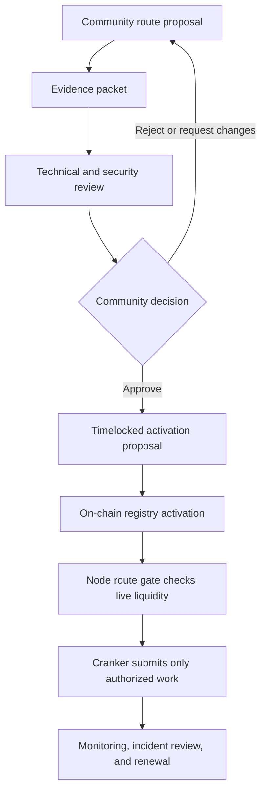

# TSN community and route governance

This guide defines how the TSN community can help expand settlement routing
without treating popularity as a substitute for cryptographic authorization,
liquidity evidence, or security review. It is an internal operating guide and
does not claim that community governance is already live on Creditcoin.

## Why community governance belongs in TSN

TSN is a DESP-oriented Transfer Settlement Network. A new destination route
changes settlement infrastructure: it introduces a new chain, token, executor,
liquidity source, fee model, finality assumption, and operational dependency.
Those choices should be visible to the people who operate, fund, build on, and
use the route.

The community helps decide which routes deserve technical review and
activation. It does not replace Node validation, the Cranker's exact
submission boundary, Attestcoin proof verification, or the destination vault's
stablecoin controls.

## Community roles

| Participant | Contribution | Authority boundary |
| --- | --- | --- |
| Users and merchants | Demand, route feedback, failure reports, and usability evidence | Cannot change an authorized payment |
| Liquidity providers and treasuries | Stablecoin liquidity, limits, and operating terms | Cannot redirect another route's payout |
| Route proposers | Technical proposal, deployment addresses, tests, and risk disclosures | Cannot activate a route without review and approval |
| Node operators | Source-intent validation, route checks, authorization, and evidence collection | Cannot rewrite signed intent fields |
| Crankers | Fee-funded transaction submission on enabled networks | Cannot select routes or make payout decisions |
| Builders and reviewers | Contract review, integration tests, monitoring, and incident analysis | Cannot bypass replay or authorization checks |
| Community voters | Public acceptance or rejection of a route proposal | A vote does not create liquidity or prove code safety |

## Route admission lifecycle

The route is not eligible for user settlement merely because a proposal or
vote exists. Activation requires verified contract addresses, an approved
asset, a destination executor, an Attestcoin Inbox/Outbox path where relevant,
stablecoin liquidity, route limits, and successful testnet evidence.

## Required route proposal

Every proposal must include the network and chain identifiers, RPC, explorer,
finality, native gas asset, address model, stablecoin contract and decimals,
liquidity owner, vault, executor, Inbox/Outbox path, route ID, replay rules,
operator keys and fees, threat model, and real Devnet/Testnet evidence.

The evidence packet must contain deployment receipts, configuration calls,
liquidity observations, route-readiness results, and a completed payout test.
Raw TIN values, device keys, private balances, and plaintext receiving roots
must never appear in a public route proposal.

## Verified identity and voting design

The intended registry should bind proposals to verified identities on the
relevant source and settlement domains. A submitted signature must recover to
the registered address and bind to the proposal action; an address is not
automatically safe because it signed a message.

Before an on-chain registry is implemented, the team must specify quorum,
voting period, voter eligibility, duplicate-vote prevention, delegation, sybil
resistance, conflict disclosure, proposal expiry, emergency pause, timelocks,
and route retirement. A boolean vote flag is not enough to establish quorum or
voter eligibility.

The registry must separate proposal approval from operational activation. A
community vote can approve a route candidate; only a validated, timelocked
activation can make it eligible for Node route admission.

## Current observed status

Creditcoin core contracts are deployed on CC3 Testnet, but the Node route gate
currently reports no configured destination routes. The proposed community
registry has not been deployed or activated. The correct status is:

> Community route governance: design documented; on-chain implementation and
> live route vote not yet deployed.

This status remains until a real registry address, proposal event, vote
evidence, activation event, route liquidity observation, and payout transaction
exist on the relevant testnet.

## Review and incident process

Every route change records expected behavior, observed behavior, the difference,
evidence links, and next action. A suspected token freeze, wrong executor,
stale liquidity proof, replay, chain instability, or signer compromise pauses
new route admission while existing settlements are reviewed. The community
receives an incident summary and a decision to resume, replace, or retire the
route.

DeFi decentralizes financial services; DESP decentralizes settlement
infrastructure.
