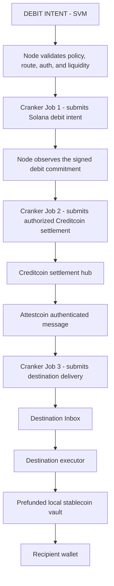

# Debit → Exit Cross-Chain Architecture

## Chain roles

Solana is the source accounting chain. Creditcoin is the first EVM settlement
domain and the source chain for onward EVM messages. A destination EVM network
is eligible only when its route, payout contract, token, and liquidity
observation are registered and verified.



## Destination route eligibility

## Adapter layout

Solana is TSN's settlement source and remains unchanged. Each EVM destination
is isolated under `contracts/adapters/<network>/`. An adapter contains that
network's prefunded stablecoin vault, settlement executor, deployment
configuration, and any proof-readable liquidity contract required by
Attestcoin. New networks clone the adapter template and provide their own RPC,
chain ID, Attestcoin chain key, token, finality, explorer, and deployment
evidence without changing Solana or the shared settlement contracts.

The Node performs a fast preflight before Solana debit submission. It checks
the destination allowlist, token mapping, payout contract, expiry, and the most
recent verified liquidity observation. This prevents an obviously unfunded
route from being selected.

The cryptographic acceptance boundary is on Creditcoin:

```text
Destination liquidity contract emits LiquidityAvailable
  -> Attestcoin proof worker uses the official USC proof flow
  -> DestinationLiquidityASC verifies the source proof through 0x0FD2
  -> DestinationLiquidityRegistry records the verified observation
  -> Node can accept the route until the observation expires
```

The registry records evidence and reservations; it does not custody
stablecoins. The destination payout vault remains the source of value.
After the destination executor's payout event is observed, the Creditcoin hub
owner releases the corresponding registry reservation. That operation only
frees accounting capacity; it cannot transfer destination funds or authorize a
new settlement.

## Creditcoin as source for onward EVM settlement

After the signed Creditcoin transaction is submitted, the Hub consumes the
authorized Solana exit commitment and becomes the source of the onward EVM
instruction. The destination route then uses the Attestcoin message layer for
the selected network, whether that network is Creditcoin or another supported
EVM chain:

```text
Attestcoin settlement
  -> publish authenticated route instruction
  -> Attestcoin attestation / relayer delivery
  -> selected network verifies and executes the Attestcoin message
  -> selected network's prefunded vault releases stablecoins
  -> stablecoin transfer to recipient
```

The SDK/proof worker prepares evidence and route data; a relayer delivers a
message transaction. Neither component creates destination liquidity.

## Preserved Solana boundaries

This layer does not change sealed TIP-head overwrite, the two-phase exit
commitment, Path 1/2 debit-credit wiring, the one-vault model, liability PDAs,
GPRU-only authorization, TSN CPI orchestration, or
`register_tcap_exit_payout_v1`. Raw TIN values, device keys, and private
balances are not sent to EVM chains.

## Implementation status

The direct Creditcoin Hub, destination route registry/ASC, destination vault,
and destination executor are the executable foundation. Each destination still
requires its supported Attestcoin Inbox route, a prefunded vault, a registered
executor, and a proof-backed liquidity observation before activation.

Official references: [Attestcoin dApp infrastructure](https://docs.attestcoin.org/attestcoin-protocol/dapp-builder-infrastructure),
[ASC contracts](https://www.npmjs.com/package/%40gluwa/asc-contracts), and the
[official examples](https://github.com/gluwa/attestcoin-protocol-examples).
