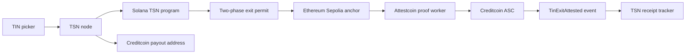

# TSN Cross-Chain Architecture

## Boundaries

Solana remains the settlement authority for TIN resolution, authorization,
sealed TIP state, liability accounting, and the two-phase exit. The TSN node is
an adapter and tracker. Creditcoin is the first EVM destination and leader for
the cross-chain integration; it is not a replacement vault for Solana.



## TIN picker

The picker selects a registered settlement domain, not a new identity. A
destination option contains a chain key, address format, token mapping, and
adapter capabilities. The UI must validate the address for the selected
network and show that the Solana debit remains the source operation.

```text
TIN -> resolve identity -> choose network -> validate destination address
    -> request existing TSN exit intent -> authorize on owner device
    -> node submits exact authorized Solana instructions
```

The intent commitment binds the settlement context. Cleartext destination data
must not be added to the intent-debit instruction merely because the payout is
cross-chain. The node may carry the destination through the authenticated
adapter job, subject to the existing authorization and merchant override rules.

## Creditcoin exit

1. The existing Solana flow creates the exit intent and records the source-side
   commitment.
2. The existing payout instruction, `register_tcap_exit_payout_v1`, consumes
   the authorized permit and pays the configured destination path.
3. The node records a redacted tracker entry containing settlement ID, source
   network, destination network, evidence digest, and adapter status.
4. If an attestation receipt is requested, the node anchors the digest on an
   EVM source chain supported by Attestcoin and submits the resulting proof to
   the Creditcoin ASC.

## Evidence payload

The EVM anchor payload is derived from, but does not expose, Solana private
state:

```text
domain = TSN_CROSS_CHAIN_ANCHOR_V1
settlementId
sealedTipHeadHash
amount
tokenIdentifier
tinHash
exitCommitment
sourceNetwork = solana-devnet
destinationNetwork = creditcoin-testnet
```

The anchor stores or emits a digest of this canonical payload. Creditcoin
verifies the anchor transaction inclusion; the ASC then checks the decoded
payload, destination domain, amount, and replay key before emitting a receipt.

## What is intentionally unchanged

There is no Solana program migration in this layer. Sealed TIP overwrite,
exit-permit commitment, TSN CPI orchestration, Path 1/2 liability movement,
one-vault custody, liability PDAs, and GPRU-only authorization remain owned by
the existing Solana implementation.

## Executable components

`SepoliaAnchor.sol` emits the canonical evidence tuple on Ethereum Sepolia.
`TinExitAttestedASC.sol` inherits the official Attestcoin `ASCBase`, so its
proof entry point is the standard `execute` method. The ASC decodes the proved
receipt with `EvmV1Decoder`, checks the anchor emitter, and emits the optional
receipt exactly once per settlement. The worker performs the documented
`waitUntilHeightAttested` → `getProof` → `PrecompileBlockProver.verifySingle`
sequence before submitting the same proof to Creditcoin.
