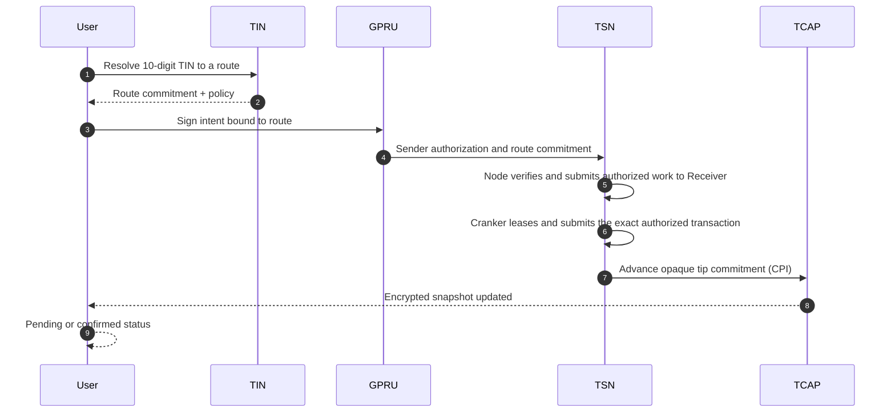

**In plain English:** From the user's side, a TSN payment is one action: enter a 10-digit TIN, review the amount, and approve. The protocol then resolves the route, verifies the authorization, coordinates settlement, and records a private credit. Timing depends on wallet approval, service leases, Solana confirmation, and the current settlement path.

## What the user sees

```text
1. Type a 10-digit TIN
2. Confirm amount
3. See a pending or confirmed status
```

That is the intended product surface. No wallet address to copy and no settlement network to choose. The wallet still authorizes the payment, and the app should distinguish a submitted payment from a confirmed one.

## What actually happens



Each layer stays inside its boundary, so no layer needs to know more than it should.

## Layer-by-layer, in one line each

| Step           | Layer    | What it does                                                                  | What it never sees                                           |
| -------------- | -------- | ----------------------------------------------------------------------------- | ------------------------------------------------------------ |
| Look up        | **TIN**  | Resolves the 10-digit number to a route                                       | Sender's balance                                             |
| Authorize      | **GPRU** | Signs a scoped authorization                                                  | Custody of funds                                             |
| Move value     | **TSN**  | Coordinates authorized funding, acceptance, leases, and settlement submission | Recipient's private route material inside the tip transition |
| Update balance | **TCAP** | Advances the commitment tip and encrypted snapshot                            | Plaintext balance                                            |

Any single layer, on its own, is incomplete. Together, they form a payment path.

## Why the user does not see any of this

Because no layer needs the full picture, the user does not have to hand it out. The wallet approves the signed authorization, while the Node, Receiver, Cranker, TSN program, and TCAP program each perform only their assigned checks.

The product is a payment. The architecture is a set of enforced boundaries.

## Related

<CardGroup cols={2}>
  <Card title="Architecture" icon="diagram-project" href="/how-it-works/architecture">
    The current TIN, GPRU, TSN, and TCAP architecture.
  </Card>

  <Card title="FAQ" icon="circle-question" href="/how-it-works/faq">
    What is on-chain, what is private, and what operators can see.
  </Card>
</CardGroup>
